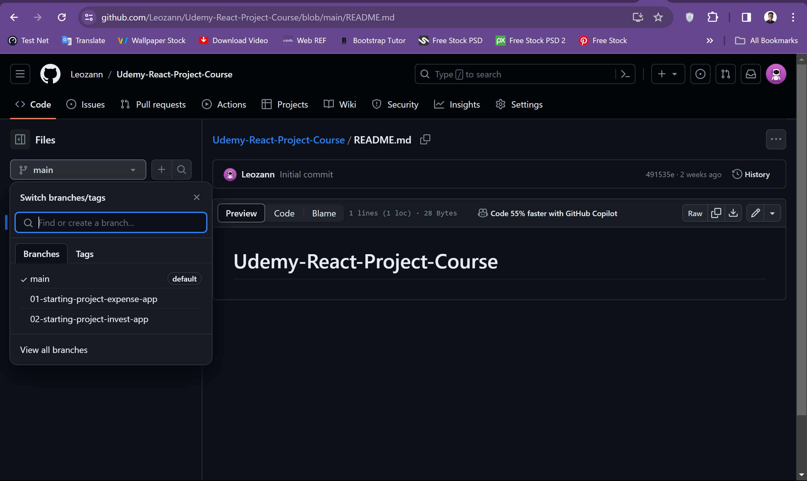

# Udemy-React-Project-Course

## About The Project
......

## Getting Started
The code snapshots are organized in multiple branches where every branch represents a course section.
You can switch branches via the branch dropdown above the directory explorer.



### Prerequisites
* Node Js
* Express JS
* Next JS
* React JS
* Code Editor: VSCode or any IDE
  
### Installation
- Clone the repository
    ```sh
    git clone https://github.com/Leozann/Udemy-React-Project-Course.git
    ```
- Install Node packages
   ```sh
   npm install
   ```
- Run the development server
    ```sh
    npm run start
    ```


### Project Snapshot


