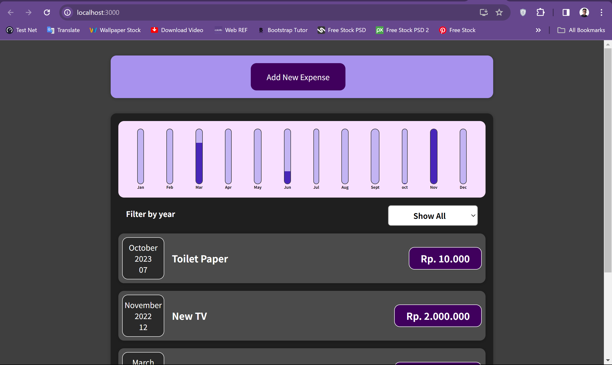

# Udemy-React-Project-Course

## About The Project
......

## Getting Started

### Prerequisites
* Node Js
* Express JS
* Next JS
* React JS
* Code Editor: VSCode or any IDE

- Clone the repository
    ```sh
    git clone https://github.com/Leozann/Udemy-React-Project-Course.git
    ```
- Install Node packages
   ```sh
   npm install
   ```
- Run the development server
    ```sh
    npm run start
    ```


### Project Snapshot


